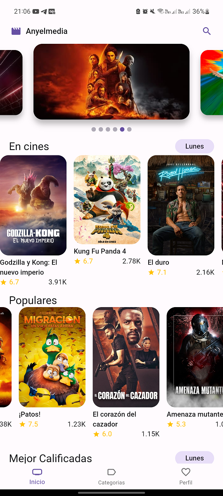

# MovieDB App Mobile Films in Flutter
This is a mobile application developed in Flutter that utilizes The Movie Database (TMDb) API to display information about movies. The application allows users to explore popular movies, search for movies by title, view movie details, and mark movies as favorites. 

## **Select Language:**
- [Español (Spanish)](README-es.md)
- [English](README.md)

## Result
### Home
 
### Show Films Part 1 
 
### Show Films Part 2
 
### Search 
 


## Environment Setup

The application uses an `.env` file to store the TMDb API key. Make sure to configure this key in a file named `.env` at the root of the project:

```
THE_MOVIEDB_KEY=b7f5a860b7790e5e8817fe083853528d
```

## Used Libraries

The application makes use of the following Flutter libraries:

- `animate_do: ^3.0.2`
- `card_swiper: ^3.0.1`
- `dio: ^5.0.0`
- `flutter_dotenv: ^5.0.2`
- `flutter_riverpod: ^2.2.0`
- `flutter_staggered_grid_view: ^0.7.0`
- `go_router: ^11.1.4`
- `intl: ^0.18.0`
- `isar: ^3.0.5`
- `isar_flutter_libs: ^3.0.5`
- `path_provider: ^2.1.1`

## Application Routes

The application routes are defined using `go_router`. These are the main routes:

- `/home/:page`: Home page that displays movies based on the specified page.
- `/movie/:id`: Movie details page.

## Infrastructure Data Sources

The application utilizes different data sources to fetch information about movies and actors. Some of these sources include:

- `MoviedbDatasource`: Retrieves movie information using the TMDb API.
- `ActorMovieDbDatasource`: Retrieves actor information from movies using the TMDb API.
- `IsarDatasource`: Handles local data persistence using the Isar database.

## Repositories

Repositories are responsible for coordinating data sources and providing necessary information to higher layers of the application. Some examples of repositories are:

- `MovieRepositoryImpl`: Implements methods to fetch different types of movies (popular, top-rated, etc.).
- `ActorRepositoryImpl`: Implements methods to fetch actors from movies.

## Search Delegates

The application uses a custom search delegate to allow users to search for movies by title. The delegate handles the search logic and displays results in real-time.

## Main Screens

The application features the following main screens:

- `HomeScreen`: Main screen that displays different categories of movies and allows users to navigate between them.
- `MovieScreen`: Screen that displays details of a specific movie, including its synopsis, cast, and genres.

## Custom Components

The application includes various custom components such as horizontal movie lists, customized navigation bars, and movie details enriched with images and text.